# Лабораторные работы

## Лаба 2

### Задание 1

```python
def min_max(nums):
    if not nums:
        raise ValueError("Список не может быть пустым")
    
    return (min(nums), max(nums))


def unique_sorting(nums):
    unique_nums = set(nums)      
    sorted_nums = sorted(unique_nums)  
    return sorted_nums


def flatten(mat):
    result = []
    for row in mat:
        if not isinstance(row, (list, tuple)):
            raise TypeError(f"Ожидается список или кортеж, получен {type(row).__name__}")
        result.extend(row)
    return result


def main():    
    
    # Тест min_max
    print("\n1. Функция min_max(nums)")
    test_cases_minmax = [
        [3, -1, 5, 5, 0],
        [42],
        [-5, -2, -9],
        [1.5, 2, 2.0, -3.1]
    ]
    
    for nums in test_cases_minmax:
        result = min_max(nums)
        print(f"  {nums} → {result}")
    
    # Тест с пустым списком
    try:
        min_max([])
    except ValueError as e:
        print(f"  [] → ValueError: {e}")
    
    # Тест unique_sorting
    print("\n2. Функция unique_sorting(nums)")
    test_cases_unique = [
        [3, 1, 2, 1, 3],
        [],
        [-1, -1, 0, 2, 2],
        [1.0, 1, 2.5, 2.5, 0]
    ]
    
    for nums in test_cases_unique:
        result = unique_sorting(nums)
        print(f"  {nums} → {result}")
    
    # Тест flatten
    print("\n3. Функция flatten(mat)")
    test_cases_flatten = [
        [[1, 2], [3, 4]],
        [[1, 2], (3, 4, 5)],
        [[1], [], [2, 3]]
    ]
    
    for mat in test_cases_flatten:
        result = flatten(mat)
        print(f"  {mat} → {result}")
    
    # Тест с некорректным типом
    try:
        flatten([[1, 2], "ab"])
    except TypeError as e:
        print(f"  [[1, 2], \"ab\"] → TypeError: {e}")
    
    
if __name__ == "__main__":
    main()
```
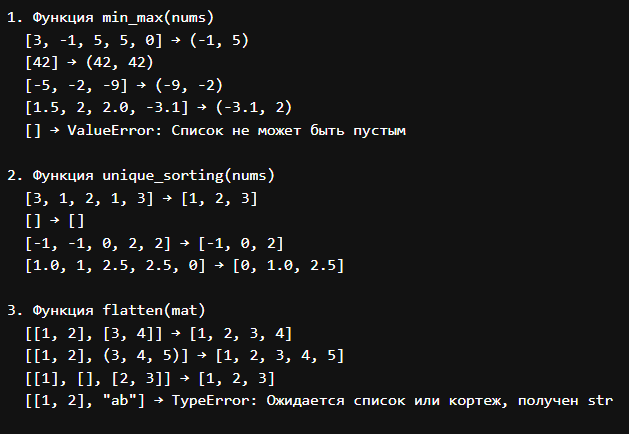

### Задание 2

```python
def is_rectangular(mat):
    if not mat:
        return True
    
    first_len = len(mat[0])
    for row in mat:
        if len(row) != first_len:
            return False
    return True


def transpose(mat):
    if not is_rectangular(mat):
        raise ValueError("Матрица должна быть прямоугольной")
    
    result = []
    for i in range(len(mat[0])):
        new_row = []
        for j in range(len(mat)):
            new_row.append(mat[j][i])
        result.append(new_row)
    return result


def row_sums(mat):
    if not is_rectangular(mat):
        raise ValueError("Матрица должна быть прямоугольной")
    
    sums = []
    for row in mat:
        sums.append(sum(row))
    return sums


def print_matrix(mat, title=""):
    if title:
        print(title)
    for row in mat:
        print(row)


def main():
    print("ОПЕРАЦИИ С МАТРИЦАМИ")
    
    # Тестовая матрица
    matrix = [[1, 2, 3], [4, 5, 6], [7, 8, 9]]
    
    print("\nИсходная матрица:")
    print_matrix(matrix)
    
    print("\nТранспонированная матрица:")
    print_matrix(transpose(matrix))
    
    print("\nСуммы строк:")
    print(row_sums(matrix))
    
    # Тест с ошибкой
    print("\nТест с рваной матрицей:")
    try:
        wrong_matrix = [[1, 2], [3]]
        transpose(wrong_matrix)
    except ValueError as e:
        print(f"Ошибка: {e}")


if __name__ == "__main__":
    main()
```
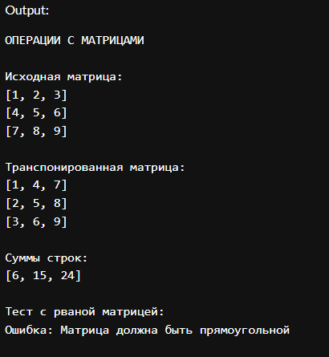

### Задание 3

```python
def format_record(rec):
    fio, group, gpa = rec
    
    # Очистка ФИО
    fio_parts = fio.strip().split()
    fio_parts = [part.capitalize() for part in fio_parts]
    
    # Форматируем фамилию и инициалы
    surname = fio_parts[0]
    initials = []
    for i in range(1, len(fio_parts)):
        if fio_parts[i]:
            initials.append(fio_parts[i][0].upper() + ".")
    
    if initials:
        formatted_fio = f"{surname} {''.join(initials)}"
    else:
        formatted_fio = surname
    
    # Форматируем строку
    formatted_str = f"{formatted_fio}, гр. {group}, GPA {gpa:.2f}"
    
    return formatted_str


def main():
    print("ФОРМАТИРОВАНИЕ ЗАПИСЕЙ СТУДЕНТОВ")
    
    test_cases = [
        ("Росинский Леонид Андреевич", "BIVT-25", 4.6),
        ("Петров Пётр", "IKBO-12", 5.0),
        ("  сидорова  анна   сергеевна ", "ABB-01", 3.999),
        ("Смирнов Алексей", "БИВТ-22", 4.5),
    ]
    
    for rec in test_cases:
        result = format_record(rec)
        print(f"Вход: {rec}")
        print(f"Результат: {result}\n")


if __name__ == "__main__":
    main()
```


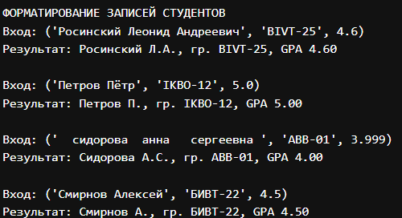

## Лаба 3
### Задание 1
```python
import re

def normalize(text, casefold=True, yo2e=True):
    if not text:
        return ""
    
    result = text
    
    if yo2e:
        result = result.replace('ё', 'е').replace('Ё', 'Е')
    
    if casefold:
        result = result.casefold()
    
    result = result.strip()
    result = re.sub(r'\s+', ' ', result)
    
    return result

def tokenize(text):
    if not text:
        return []
    
    return re.findall(r'[\w\-]+', text)

def count_freq(tokens):
    freq = {}
    for token in tokens:
        freq[token] = freq.get(token, 0) + 1
    return freq

def top_n(freq, n=5):
    if not freq:
        return []
    
    sorted_items = sorted(freq.items(), key=lambda x: (-x[1], x[0]))
    return sorted_items[:n]

def test_functions():
    print("ТЕСТИРОВАНИЕ ФУНКЦИЙ")
    print("=" * 50)
    
    # Тесты для normalize
    print("\n1. normalize():")
    test_cases = [
        ("ПрИвЕт\nМИр\t", "привет мир"),
        ("ёжик, Ёлка", "ежик, елка"),
        ("Hello\r\nWorld", "hello world"),
        ("  двойные   пробелы  ", "двойные пробелы"),
    ]
    
    for input_text, expected in test_cases:
        result = normalize(input_text)
        print(f"  '{input_text}' → '{result}'")
    
    # Тесты для tokenize
    print("\n2. tokenize():")
    test_cases = [
        ("привет мир", ["привет", "мир"]),
        ("hello,world!!!", ["hello", "world"]),
        ("по-настоящему круто", ["по-настоящему", "круто"]),
        ("2025 год", ["2025", "год"]),
        ("emoji 😀 не слово", ["emoji", "не", "слово"]),
    ]
    
    for input_text, expected in test_cases:
        result = tokenize(input_text)
        print(f"  '{input_text}' → {result}")
    
    # Тесты для count_freq + top_n
    print("\n3. count_freq() + top_n():")
    
    tokens1 = ["a", "b", "a", "c", "b", "a"]
    freq1 = count_freq(tokens1)
    top1 = top_n(freq1, 2)
    print(f"  {tokens1} → {top1}")
    
    tokens2 = ["bb", "aa", "bb", "aa", "cc"]
    freq2 = count_freq(tokens2)
    top2 = top_n(freq2, 2)
    print(f"  {tokens2} → {top2}")
def demo_text_analysis():
    """Демонстрационный текст для анализа во 2 задании"""
    demo_text = "Привет Мир!!! Привет!.."

if __name__ == "__main__":
    test_functions()
```
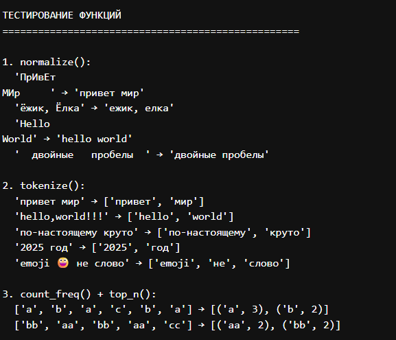
### Задание 2
```python
import sys
from scr.lib.text import normalize, tokenize, count_freq, top_n 

def main():
    demo_text = "Привет Мир!!! Привет!.."
    print("-" * 30)
    print("\nПример анализа этого текста:")
    print("-" * 30)
    # Обрабатываем текст через функции 
    normalized_text = normalize(demo_text)
    tokens = tokenize(normalized_text)
    frequencies = count_freq(tokens)
    top_words = top_n(frequencies, 5)
    
    # Выводим результаты
    print(f"Всего слов: {len(tokens)}")
    print(f"Уникальных слов: {len(frequencies)}")
    print("Топ-5:")
    
    for word, count in top_words:
        print(f"{word}:{count}")

if __name__ == "__main__":
    main()
```
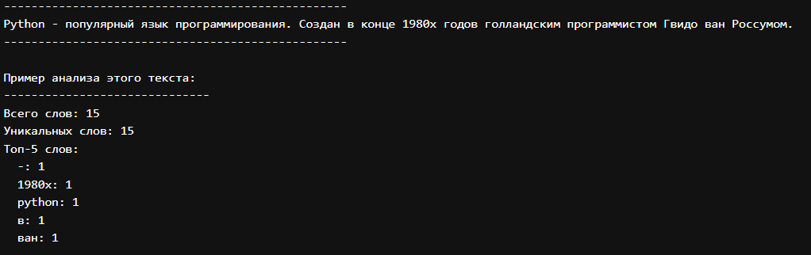

## Лаба 4
### Задание 1

```python
import csv
from pathlib import Path
def read_text(path: str | Path, encoding: str = "utf-8") -> str:
    with open(path, 'r', encoding=encoding) as f:
        return f.read()

def write_csv(rows: list[tuple | list], path: str | Path, header: tuple[str, ...] | None = None) -> None:
    if rows and len(set(len(row) for row in rows)) != 1:
        raise ValueError("Все строки должны иметь одинаковую длину")
    
    with open(path, 'w', newline='', encoding='utf-8') as f:
        writer = csv.writer(f)
        if header:
            writer.writerow(header)
        writer.writerows(rows)

if __name__ == "__main__":
    try:
        txt = read_text('src/lab04/Text.test')
        print(f"Прочитано: {txt}")
    except FileNotFoundError:
        print("Файл text.txt не найден")
    
    write_csv([("word", "count"), ("test", 3)], "table.csv")  
    print("файл csv создан!")
```
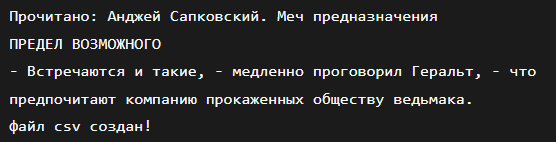

### Задание 2
```python
import sys, os, csv
from collections import Counter

sys.path.insert(0, os.path.join(os.path.dirname(__file__), '..', '..'))

try:
    from scr.lab03.ex01 import normalize, tokenize
except ImportError as e:
    sys.exit(f"Ошибка импорта: {e}")

def main():
    input_file = 'src/lab04/Text.test'
    output_file = 'src/lab04/Table.csv'

    try:
        with open(input_file, 'r', encoding='utf-8') as f:
            text = f.read()
        if not text.strip():
            sys.exit("Файл пустой")
    except Exception as e:
        sys.exit(f"Ошибка чтения {input_file}: {e}")
    
    try:
        normalized = normalize(text)
        words = tokenize(normalized)
        if not words:
            sys.exit("После обработки слов не найдено")
        word_freq = Counter(words)
    except Exception as e:
        sys.exit(f"Ошибка обработки текста: {e}")


    try:
        os.makedirs(os.path.dirname(output_file), exist_ok=True)
        with open(output_file, 'w', encoding='utf-8', newline='') as f:
            writer = csv.writer(f)
            writer.writerow(['word', 'count'])
            for word, count in sorted(word_freq.items(), key=lambda x: (-x[1], x[0])):
                writer.writerow([word, count])
    except Exception as e:
        sys.exit(f"Ошибка сохранения {output_file}: {e}")
    
    top5 = sorted(word_freq.items(), key=lambda x: (-x[1], x[0]))[:5]
    print(f"Всего слов: {len(words)}")
    print(f"Уникальных слов: {len(word_freq)}")
    print('Топ 5:')
    k = 0
    print(f'{"слово:":^15} |{"частота":^15}')
    print(f"{'----------'*3:^30}")
    for word, counts in top5:
        if k == 5:
            break
        k += 1
        print(f'{word:^15} |{counts:^15}')

if __name__ == "__main__":
    main()
```
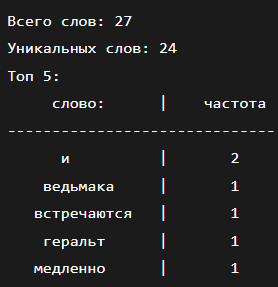
## Лаба 5
### Задание 1
```python
import csv, json
from pathlib import Path


def json_to_csv(json_path: str, csv_path: str) -> None:

    json_file = Path(json_path)
    csv_file = Path(csv_path)
    print(f" Ищем файл: {json_path}")
    if not json_file.exists():
        raise FileNotFoundError(f"Файл {json_path} не найден")
    
    if json_file.suffix.lower() != ".json":
        raise ValueError("Неверный тип файла. Ожидается .json")
    
    try:
        with json_file.open('r', encoding='utf-8') as f:
            data = json.load(f)
    except json.JSONDecodeError as e:
        raise ValueError(f"Ошибка чтения JSON: {e}")
    
    if not data:
        raise ValueError("Пустой JSON или неподдерживаемая структура")
    
    if not isinstance(data, list):
        raise ValueError("JSON должен содержать список объектов")
    
    if not all(isinstance(item, dict) for item in data):
        raise ValueError("Все элементы JSON должны быть словарями")
    
    all_keys = set()
    for item in data:
        all_keys.update(item.keys())

    if data:
        first_item_keys = list(data[0].keys())
        remaining_keys = sorted(all_keys - set(first_item_keys))
        fieldnames = first_item_keys + remaining_keys
    else:
        fieldnames = sorted(all_keys)
    # Запись в CSV
    try:
        with csv_file.open('w', newline='', encoding='utf-8') as f:
            writer = csv.DictWriter(f, fieldnames=fieldnames)
            writer.writeheader()
            for row in data:
                complete_row = {key: row.get(key, '') for key in fieldnames}
                writer.writerow(complete_row)
    except Exception as e:
        raise ValueError(f"Ошибка записи CSV: {e}")

def csv_to_json(csv_path: str, json_path: str) -> None:
  
    csv_file = Path(csv_path)
    json_file = Path(json_path)
    
    if not csv_file.exists():
        raise FileNotFoundError(f"Файл {csv_path} не найден")

    if csv_file.suffix.lower() != '.csv':
        raise ValueError("Неверный тип файла. Ожидается .csv")
    
    try:
        with csv_file.open('r', encoding='utf-8') as f:
            reader = csv.DictReader(f, delimiter='\t')
            if reader.fieldnames is None:
                raise ValueError("CSV файл не содержит заголовка")
            
            data = list(reader)
            
    except Exception as e:
        raise ValueError(f"Ошибка чтения CSV: {e}")

    if not data:
        raise ValueError("Пустой CSV файл")

    try:
        with json_file.open('w', encoding='utf-8') as f:
            json.dump(data, f, ensure_ascii=False, indent=2)
    except Exception as e:
        raise ValueError(f"Ошибка записи JSON: {e}")

json_to_csv(r"C:\Users\Librix\Desktop\labs\python_labs\data\samples\people.json", r"C:\Users\Librix\Desktop\labs\python_labs\data\samples\out\people_from_json.csv")
csv_to_json(r"C:\Users\Librix\Desktop\labs\python_labs\data\samples\people.csv", r"C:\Users\Librix\Desktop\labs\python_labs\data\samples\out\people_from_csv.json")
```
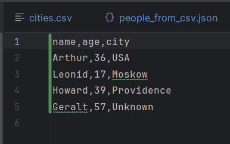
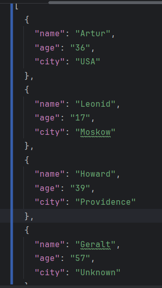
### Задание 2
```python
import csv, json
from pathlib import Path
from openpyxl import Workbook


def json_to_csv(json_path: str, csv_path: str) -> None:
    json_file = Path(json_path)
    csv_file = Path(csv_path)
    print(f" Ищем файл: {json_path}")
    if not json_file.exists():
        raise FileNotFoundError(f"Файл {json_path} не найден")

    if json_file.suffix.lower() != ".json":
        raise ValueError("Неверный тип файла. Ожидается .json")

    try:
        with json_file.open('r', encoding='utf-8') as f:
            data = json.load(f)
    except json.JSONDecodeError as e:
        raise ValueError(f"Ошибка чтения JSON: {e}")

    if not data:
        raise ValueError("Пустой JSON или неподдерживаемая структура")

    if not isinstance(data, list):
        raise ValueError("JSON должен содержать список объектов")

    if not all(isinstance(item, dict) for item in data):
        raise ValueError("Все элементы JSON должны быть словарями")

    all_keys = set()
    for item in data:
        all_keys.update(item.keys())

    if data:
        first_item_keys = list(data[0].keys())
        remaining_keys = sorted(all_keys - set(first_item_keys))
        fieldnames = first_item_keys + remaining_keys
    else:
        fieldnames = sorted(all_keys)

    try:
        with csv_file.open('w', newline='', encoding='utf-8') as f:
            writer = csv.DictWriter(f, fieldnames=fieldnames)
            writer.writeheader()
            for row in data:
                complete_row = {key: row.get(key, '') for key in fieldnames}
                writer.writerow(complete_row)
    except Exception as e:
        raise ValueError(f"Ошибка записи CSV: {e}")


def csv_to_json(csv_path: str, json_path: str) -> None:
    csv_file = Path(csv_path)
    json_file = Path(json_path)

    if not csv_file.exists():
        raise FileNotFoundError(f"Файл {csv_path} не найден")

    if csv_file.suffix.lower() != '.csv':
        raise ValueError("Неверный тип файла. Ожидается .csv")

    try:
        with csv_file.open('r', encoding='utf-8') as f:
            reader = csv.DictReader(f, delimiter='\t')
            if reader.fieldnames is None:
                raise ValueError("CSV файл не содержит заголовка")

            data = list(reader)

    except Exception as e:
        raise ValueError(f"Ошибка чтения CSV: {e}")

    if not data:
        raise ValueError("Пустой CSV файл")

    try:
        with json_file.open('w', encoding='utf-8') as f:
            json.dump(data, f, ensure_ascii=False, indent=2)
    except Exception as e:
        raise ValueError(f"Ошибка записи JSON: {e}")


def csv_to_xlsx(csv_path: str, xlsx_path: str) -> None:
    """
    Конвертирует CSV в XLSX.
    Использует openpyxl. Автоматическая ширина колонок.
    """
    csv_file = Path(csv_path)
    xlsx_file = Path(xlsx_path)
    if csv_file.suffix.lower() != ".csv":
        raise ValueError("Неверный формат входного файла: ожидается .csv")
    if xlsx_file.suffix.lower() != ".xlsx":
        raise ValueError("Неверный формат выходного файла: ожидается .xlsx")
    if not csv_file.exists():
        raise FileNotFoundError("Файл не найден")

    with csv_file.open(encoding="utf-8") as f:
        reader = list(csv.reader(f, delimiter='\t'))
        if not reader:
            raise ValueError("Пустой файл")

    wb = Workbook()
    ws = wb.active
    ws.title = "Sheet1"

    for row in reader:
        ws.append(row)

    for col in ws.columns:
        max_length = 0
        column = col[0].column_letter
        for cell in col:
            value = str(cell.value) if cell.value is not None else ""
            if len(value) > max_length:
                max_length = len(value)
        adjusted_width = max(max_length + 2, 8)
        ws.column_dimensions[column].width = adjusted_width

    wb.save(xlsx_file)


json_to_csv(r"C:\Users\Librix\Desktop\labs\python_labs\data\samples\people.json",
            r"C:\Users\Librix\Desktop\labs\python_labs\data\samples\out\people_from_json.csv")
csv_to_json(r"C:\Users\Librix\Desktop\labs\python_labs\data\samples\people.csv",
            r"C:\Users\Librix\Desktop\labs\python_labs\data\samples\out\people_from_csv.json")
csv_to_xlsx(r"C:\Users\Librix\Desktop\labs\python_labs\data\samples\people.csv",
            r"C:\Users\Librix\Desktop\labs\python_labs\data\samples\out\people_from_csv.xlsx")
```
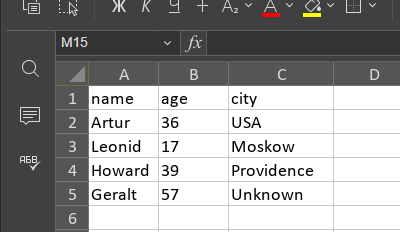

## Лаба 6
### Задание 1

```python
import sys, os
import argparse
from pathlib import Path
from lib.text_stats import stats_text

from lib.text_lib import normalize, tokenize, count_freq, top_n
from lib.io_txt_csv import read_text


def check_file(file_path: str) -> bool:
    if not os.path.exists(file_path):
        print(f"Ошибка: файл '{file_path}' не существует", file=sys.stderr)
        return False
    if not os.path.isfile(file_path):
        print(f"Ошибка: '{file_path}' не является файлом", file=sys.stderr)
        return False

    return True


def cat_command(input_file: str, number_lines: bool = False):
    if not check_file(input_file):
        sys.exit(1)

    try:
        with open(input_file, 'r', encoding='utf-8') as f:
            for line_number, line in enumerate(f, start=1):
                if number_lines:
                    print(f"{line_number:6d}  {line}", end='')
                else:
                    print(line, end='')
    except Exception as e:
        print(f"Ошибка при чтении файла: {e}", file=sys.stderr)
        sys.exit(1)


def stats_command(input_file: str, top_n: int = 5):
    if not check_file(input_file):
        sys.exit(1)

    if top_n <= 0:
        print("Ошибка: значение --top должно быть положительным числом", file=sys.stderr)
        sys.exit(1)

    try:
        with open(input_file, 'r', encoding='utf-8') as f:
            text = f.read()
            stats_text(text, top_n)

    except Exception as e:
        print(f"Ошибка при анализе файла: {e}", file=sys.stderr)
        sys.exit(1)


def main():
    parser = argparse.ArgumentParser(description="CLI-утилиты лабораторной №6")
    subparsers = parser.add_subparsers(dest="command")

    cat_parser = subparsers.add_parser("cat", help="Вывести содержимое файла")
    cat_parser.add_argument("--input", required=True)
    cat_parser.add_argument("-n", action="store_true", help="Нумеровать строки")

    stats_parser = subparsers.add_parser("stats", help="Частоты слов")
    stats_parser.add_argument("--input", required=True)
    stats_parser.add_argument("--top", type=int, default=5)

    args = parser.parse_args()

    if args.command == "cat":
        if not check_file(args.input):
            sys.exit(1)

        try:
            with open(args.input, 'r', encoding='utf-8') as f:
                if args.n:
                    for line_number, line in enumerate(f, start=1):
                        print(f"{line_number:6d}  {line}", end='')
                else:
                    for line in f:
                        print(line, end='')
        except Exception as e:
            print(f"Ошибка при чтении файла: {e}", file=sys.stderr)
            sys.exit(1)

    elif args.command == "stats":
        if not check_file(args.input):
            sys.exit(1)

        try:
            with open(args.input, 'r', encoding='utf-8') as f:
                text = f.read()
                for e in top_n(count_freq(tokenize(normalize(text))), args.top):
                    print(e[0], e[1])
        except Exception as e:
            print(f"Ошибка при анализе файла: {e}", file=sys.stderr)
            sys.exit(1)


if __name__ == "__main__":
    main()
```
#### стандартный вывод 1-го задания

#### вывод при использовании команды help
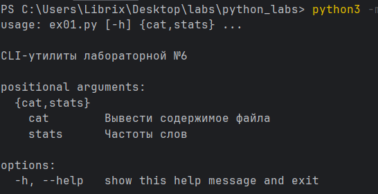
### Задание 2
```python
import sys, argparse
from pathlib import Path
import os
import contextlib
import io

from src.lab05.ex01 import json_to_csv, csv_to_json
from src.lab05.ex02 import csv_to_xlsx
from src.lab06.ex01 import check_file

def silent_check_file(file_path: str) -> bool:
    """Проверка файла без вывода на экран"""
    return os.path.exists(file_path) and os.path.isfile(file_path)

def run_silently(func, *args, **kwargs):
    """Запускает функцию без вывода на экран"""
    with contextlib.redirect_stdout(io.StringIO()):
        with contextlib.redirect_stderr(io.StringIO()):
            return func(*args, **kwargs)

def main():
    parser = argparse.ArgumentParser(description="Конвертеры данных")
    sub = parser.add_subparsers(dest="cmd")

    p1 = sub.add_parser("json2csv", help="Конвертатор из JSON в CSV")
    p1.add_argument("--in", dest="input", required=True)
    p1.add_argument("--out", dest="output", required=True)

    p2 = sub.add_parser("csv2json", help="Конвертатор из CSV в JSON")
    p2.add_argument("--in", dest="input", required=True)
    p2.add_argument("--out", dest="output", required=True)

    p3 = sub.add_parser("csv2xlsx", help="Конвертатор из CSV в Excel")
    p3.add_argument("--in", dest="input", required=True)
    p3.add_argument("--out", dest="output", required=True)

    args = parser.parse_args()

    try:
        if args.cmd == "json2csv":
            if not silent_check_file(args.input):
                print(f"Ошибка: Файл {args.input} не существует или недоступен")
                sys.exit(1)

            run_silently(json_to_csv, args.input, args.output)
            print(f"Успешно: JSON -> CSV")

        elif args.cmd == "csv2json":
            if not silent_check_file(args.input):
                print(f"Ошибка: Файл {args.input} не существует или недоступен")
                sys.exit(1)

            run_silently(csv_to_json, args.input, args.output)
            print(f"Успешно: CSV -> JSON")

        elif args.cmd == "csv2xlsx":
            if not silent_check_file(args.input):
                print(f"Ошибка: Файл {args.input} не существует или недоступен")
                sys.exit(1)

            run_silently(csv_to_xlsx, args.input, args.output)
            print(f"Успешно: CSV -> XLSX")

        else:
            print("Ошибка: Неизвестная команда")
            sys.exit(1)

        return 0

    except Exception as e:
        print(f"Ошибка при конвертации: {str(e)}")
        sys.exit(1)

if __name__ == "__main__":
    main()
```
#### стандартный вывод 2-го задания
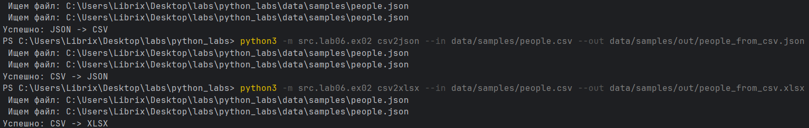
#### вывод help 2-го задания
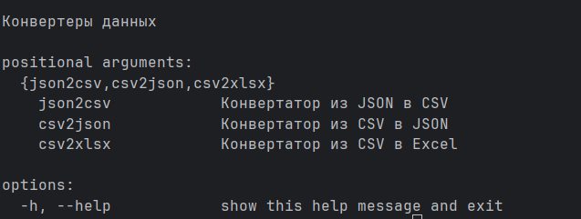
## Лаба 7
### Задание 1
```python
import pytest
import sys
import os

sys.path.insert(0, os.path.abspath(os.path.join(os.path.dirname(__file__), "..")))

from lib.text_lib import normalize, tokenize, count_freq, top_n


@pytest.mark.parametrize(
    "source, expected",
    [
        ("ПрИвЕт\nМИр\t", "привет мир"),  # обычный текст + спецсимволы
        ("ёжик, Ёлка", "ежик, елка"),  # буквы с разным регистром
        ("Hello\r\nWorld", "hello world"),  # английский текст
        ("  двойные   пробелы  ", "двойные пробелы"),  # лишние пробелы
        ("", ""),  # пустая строка
        ("\t\n   ", ""),  # только пробельные символы
    ],
)
def test_normalize(source, expected):
    assert normalize(source) == expected


@pytest.mark.parametrize(
    "source, expected",
    [
        ("привет мир", ["привет", "мир"]),  # обычный текст
        ("один, два, три!", ["один", "два", "три"]),  # спецсимволы и знаки препинания
        ("", []),  # пустая строка
        ("   много   пробелов   ", ["много", "пробелов"]),  # повторяющиеся пробелы
        ("слово слово слово", ["слово", "слово", "слово"]),  # повторяющиеся слова
    ],
)
def test_tokenize(source, expected):
    assert tokenize(source) == expected


@pytest.mark.parametrize(
    "tokens, expected",
    [
        (["a", "b", "a", "c", "b", "a"], {"a": 3, "b": 2, "c": 1}),
        ([], {}),
    ],
)
def test_count_freq(tokens, expected):
    assert count_freq(tokens) == expected


@pytest.mark.parametrize(
    "freq_dict, expected",
    [
        ({"a": 3, "b": 2, "c": 1}, [("a", 3), ("b", 2), ("c", 1)]),  # обычный случай
        (
            {
                "яблоко": 2,
                "апельсин": 2,
                "банан": 2,
            },  # одинаковые частоты → сортировка по алфавиту
            [("апельсин", 2), ("банан", 2), ("яблоко", 2)],
        ),
        ({}, []),  # пустой словарь
        (
            {
                "a": 5,
                "b": 4,
                "c": 3,
                "d": 2,
                "e": 1,
                "f": 1,
            },  # больше 5 элементов при n=5
            [("a", 5), ("b", 4), ("c", 3), ("d", 2), ("e", 1)],
        ),
    ],
)
def test_top_n(freq_dict, expected):
    assert top_n(freq_dict) == expected

```
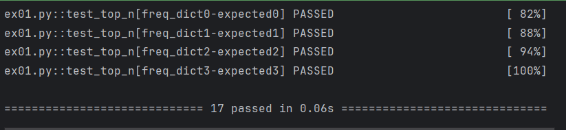
### Задание 2
```python
import json
import csv
import pytest
from pathlib import Path
import sys
import os

sys.path.insert(0, os.path.abspath(os.path.join(os.path.dirname(__file__), "..")))
from lib.json_csv import json_to_csv, csv_to_json


def test_json_to_csv_roundtrip(tmp_path: Path):  # Успешная конвертация JSON to CSV
    src = tmp_path / "people.json"
    dst = tmp_path / "people.csv"

    data = [
        {"name": "Alice", "age": 22},
        {"name": "Bob", "age": 25},
    ]

    src.write_text(json.dumps(data, ensure_ascii=False), encoding="utf-8")

    json_to_csv(str(src), str(dst))

    with dst.open(encoding="utf-8") as f:
        rows = list(csv.DictReader(f))

    assert len(rows) == 2
    assert rows[0]["name"] == "Alice"
    assert rows[1]["age"] == "25"


def test_csv_to_json_roundtrip(tmp_path: Path):  # Успешная конвертация CSV to JSON
    src = tmp_path / "people.csv"
    dst = tmp_path / "people.json"

    with src.open("w", encoding="utf-8", newline="") as f:
        writer = csv.DictWriter(f, fieldnames=["name", "age"])
        writer.writeheader()
        writer.writerow({"name": "Alice", "age": "22"})
        writer.writerow({"name": "Bob", "age": "25"})

    csv_to_json(str(src), str(dst))

    data = json.loads(dst.read_text(encoding="utf-8"))

    assert isinstance(data, list)
    assert len(data) == 2
    assert data[0]["name"] == "Alice"
    assert data[1]["age"] == "25"


def test_json_to_csv_invalid_json(
    tmp_path: Path,
):  # Входной файл "сломан"/не является корректным файлом JSON
    src = tmp_path / "broken.json"
    dst = tmp_path / "output.csv"
    src.write_text("not a json", encoding="utf-8")

    with pytest.raises(ValueError):
        json_to_csv(str(src), str(dst))


def test_csv_to_json_invalid_csv(
    tmp_path: Path,
):  # Входной файл "сломан"/не является корректным файлом CSV
    src = tmp_path / "broken.csv"
    dst = tmp_path / "output.json"
    src.write_text(",,,\n,,", encoding="utf-8")

    with pytest.raises(ValueError):
        csv_to_json(str(src), str(dst))


def test_missing_file():  # Входного файла не существует
    with pytest.raises(FileNotFoundError):
        json_to_csv("no_such_file.json", "output.csv")


def test_invalid_suffix_to_json(tmp_path: Path):  # Входной файл не CSV
    src = tmp_path / "input.txt"
    dst = tmp_path / "output.json"
    src.write_text("This is 100% json, trust me", encoding="utf-8")
    with pytest.raises(ValueError):
        csv_to_json(str(src), str(dst))
```
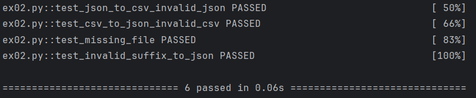
#### Форматирование кода black .

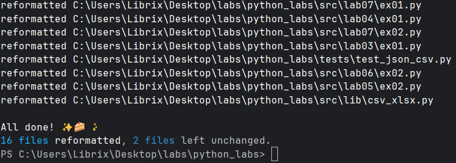