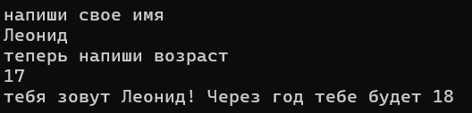

Задание 1
```c#
using System;
using System.CodeDom;
using System.Collections.Generic;
using System.Diagnostics.Eventing.Reader;
using System.IO;
using System.Linq;
using System.Text;
using System.Threading.Tasks;
using static System.Net.Mime.MediaTypeNames;

namespace Labs;
{
internal class Program
{
    static void Main(string[] args)
    {
        Console.WriteLine("напиши свое имя");
        string name = Console.ReadLine();
        Console.WriteLine("теперь напиши возраст");
        int old = Convert.ToInt32(Console.ReadLine());
        if (string.IsNullOrWhiteSpace(name))
        {
            Console.WriteLine("попробуй еще раз");

        }
        else if (old == null)
        {
            Console.WriteLine("попробуй еще раз");

        }
        else;
        Console.WriteLine($"тебя зовут {name}! Через год тебе будет {++old}");


    }
}
}


```

Задание 2
```c#
using System;
using System.CodeDom;
using System.Collections.Generic;
using System.Diagnostics.Eventing.Reader;
using System.IO;
using System.Linq;
using System.Text;
using System.Threading.Tasks;
using static System.Net.Mime.MediaTypeNames;

namespace Labs
{
    internal class Program
    {
        static void Main(string[] args)
        {
            float numb1 = Convert.ToSingle(Console.ReadLine());
            float numb2 = Convert.ToSingle(Console.ReadLine());
            float Sum = numb1 + numb2;
            float mid = Sum / 2; //Мне было очень лень искать, как это можно сделать по другому, но 100% можно сделать через перебор массива или через for
            Console.WriteLine("Сумма= " + Sum + " | ср. арифм= " + mid);


        }
    }
}
```
[text](src/lab01/ex02)

Задание 3
```c#
using System;
using System.CodeDom;
using System.Collections.Generic;
using System.Diagnostics.Eventing.Reader;
using System.IO;
using System.Linq;
using System.Text;
using System.Threading.Tasks;
using static System.Net.Mime.MediaTypeNames;

namespace Labs
{
    internal class Program
    {
        static void Main(string[] args)
        {
            Console.WriteLine("введите минуты, они будут переконвертированны в часы и минуты");
            int min = int.Parse(Console.ReadLine());
            int hours = min / 60;
            int minutes = min - (hours * 60);
            Console.WriteLine(hours + ":" + minutes);

        }
    }
}
```

Задание 4
```c#
using System;
using System.CodeDom;
using System.Collections.Generic;
using System.Diagnostics.Eventing.Reader;
using System.IO;
using System.Linq;
using System.Text;
using System.Threading.Tasks;
using static System.Net.Mime.MediaTypeNames;

namespace Labs
{
    internal class Program
    {
        static void Main(string[] args)
        {
            Console.WriteLine("Цена на продукт");
            int price = int.Parse(Console.ReadLine());
            if (price <= 0)
            {
                Console.WriteLine("Слишком низкая цена");
                return;
            }
            Console.WriteLine("Введите желаемую скидку");
            int discount = int.Parse(Console.ReadLine());
            if (discount <= 0)
            {
                Console.WriteLine("Скидка меньше 0 или равна 0, работашь в убыток");
                return;
            }

            else if (discount >= 50)
            {
                Console.WriteLine("Ну ты палку то не перегибай");
                return;
            };
            double Vat = 1.2;
            double Base = price * (1 - (discount / 100.0));
            double total = Base * Vat;
            Console.WriteLine("И того к оплате: "+ total+"$");
        }

    }
}

```

.png)
Задание 5
```c#

using System;
using System.CodeDom;
using System.Collections.Generic;
using System.Diagnostics.Eventing.Reader;
using System.IO;
using System.Linq;
using System.Text;
using System.Threading.Tasks;
using static System.Net.Mime.MediaTypeNames;

namespace Labs
{
    internal class Program
    {
        static void Main(string[] args)
        {

            string name = "Иванов Иван Иванович";
            Console.WriteLine($"ФИО: {name}");
            int length = name.Length;
            Console.WriteLine($"Длина (символов): {length}");

            string result = " ";
            for (int i = 0; i < name.Length; i++)
            {
                
                if (i == 0 || name[i - 1] == ' ')
                {
                    result += name[i];
                }
            }

            Console.WriteLine("Краткое ФИО: "+result);


        }
    }
}
```
